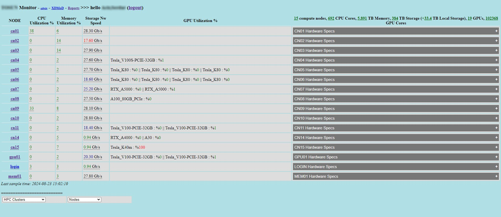
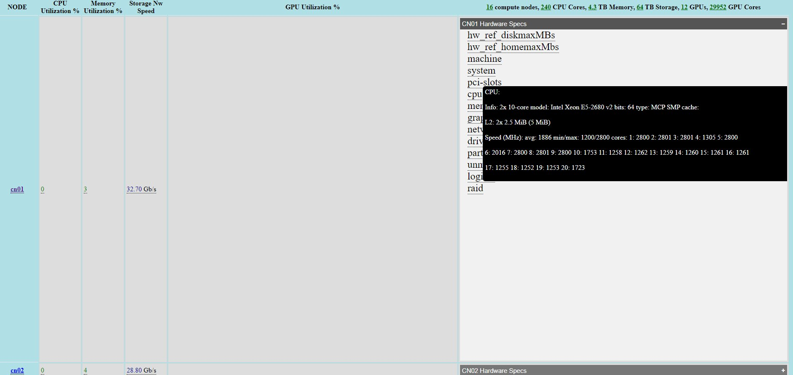
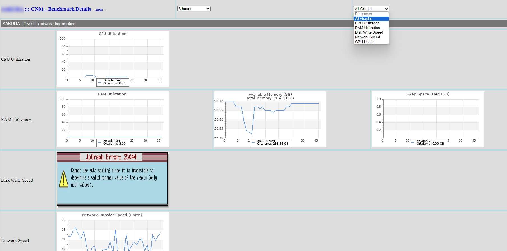
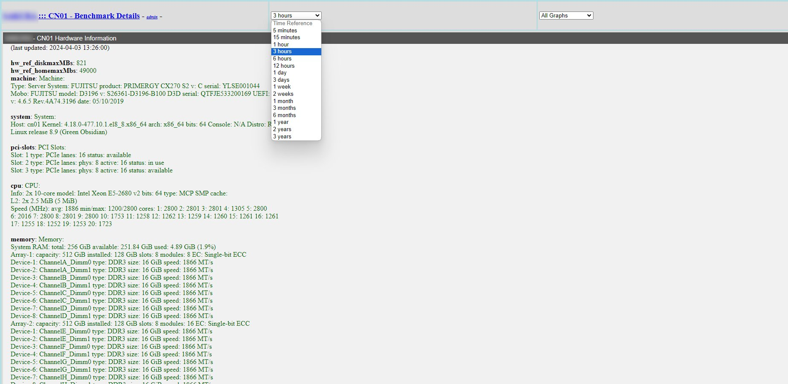
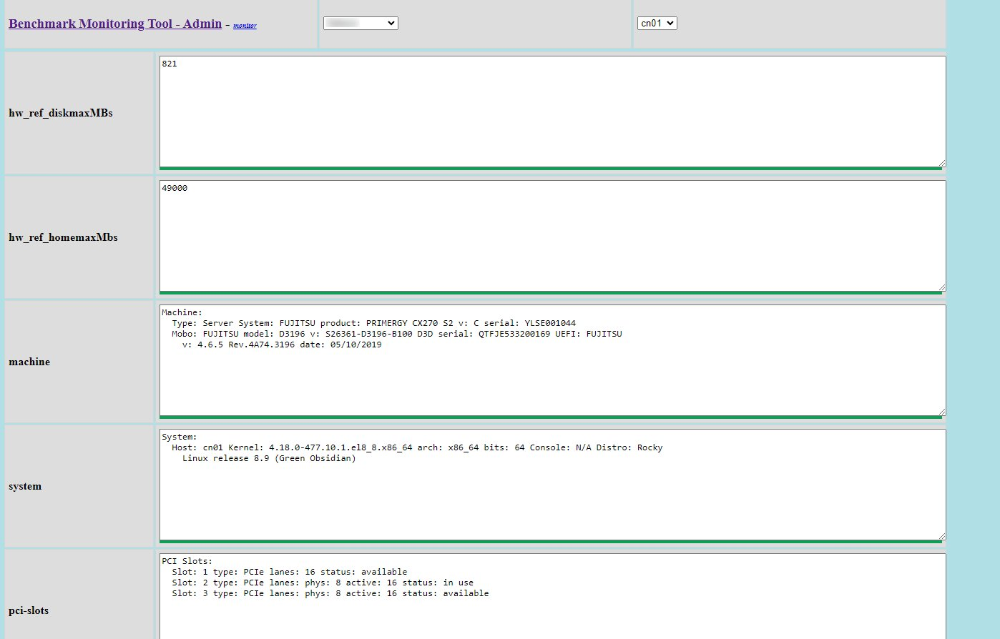

# HPC Performance Monitoring Tool
A real-time HPC performance monitoring tool with automatic node detection and basic benchmarking.
This repository contains a suite of Linux scripts designed for performance monitoring and resource benchmarking across compute nodes in an HPC environment.

## Features

### 1. Hardware Data Collection
- Detects and collects essential hardware characteristics of compute nodes.
- Gathers details such as server type, CPU, GPU, RAM, interconnect, pci, drives, partitions, raid configuration etc.

### 2. Resource Benchmarking
- Executes a series of predefined benchmarks to evaluate current available resources.
- Benchmarks include CPU and GPU performance, memory utilization, interconnect bandwidth and disk subsystem bandwidth.
- Benchmarks are run at user-defined intervals to ensure up-to-date monitoring.

### 3. Data Transmission
- The collected data is sent to a MySQL-based web server.
- The server hosts a performance monitoring GUI for comprehensive oversight of node performance and resource utilization.

## Usage

1. Clone this repository to your local environment.
2. Configure the scripts according to your specific HPC environment needs.
3. Define the desired benchmarking intervals and parameters.
4. Deploy the scripts on your login node.
5. Setup a maria-db based web server to collect data
6. Access the performance monitoring GUI through the provided MySQL web server to view the collected data.

## Requirements

- Linux-based HPC environment.
- MySQL database server.
- Web server.

## Next Work

- In future versions, the tool will be enhanced to support installation on a regular hosting server. This will enable a single point of installation, simplifying deployment and maintenance across multiple nodes in multiple HPC environments.
- Regular HPC user version will be supported.

## Limitations

- Currently, the tool is designed to work with Slurm for job scheduling and resource management. Support for additional workload managers and environments will be added in future updates to broaden the tool's compatibility and usability across different HPC setups.
- This is the root user version of the tool. Next versions will be for regular HPC users.

## Project Images

  
  
  
  
  

## Contributing

Contributions are welcome! Please feel free to submit a pull request or open an issue for any bugs or feature requests.

## License

This project is licensed under the MIT License - see the [LICENSE](LICENSE) file for details.
