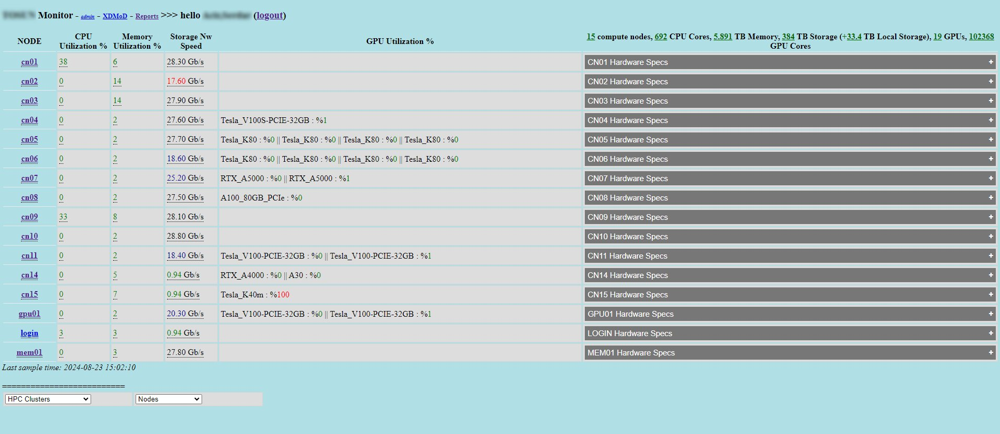
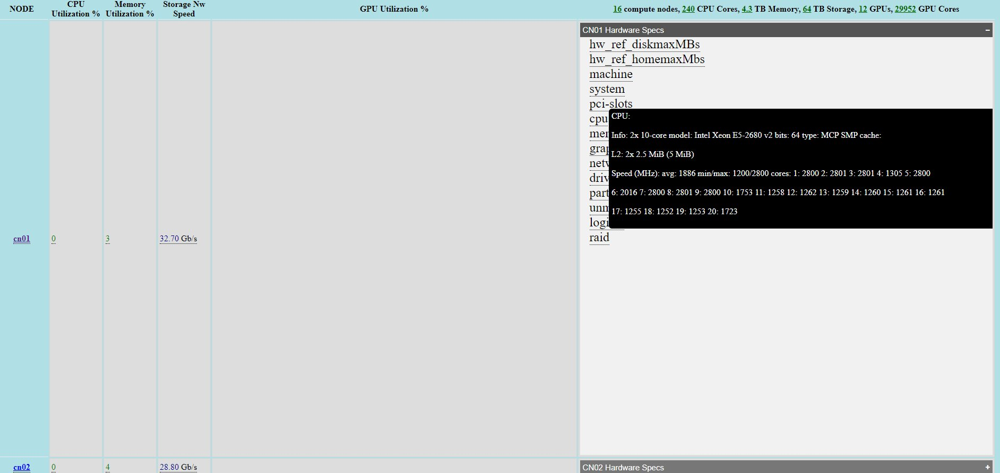
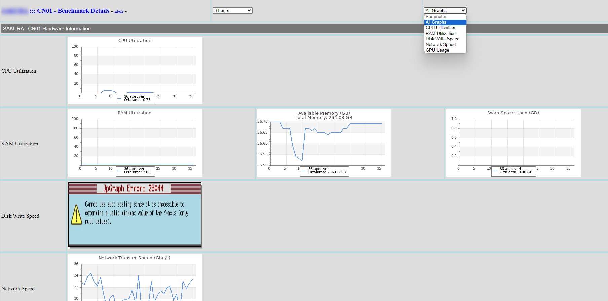
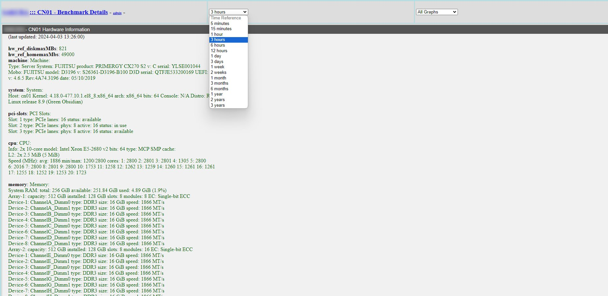
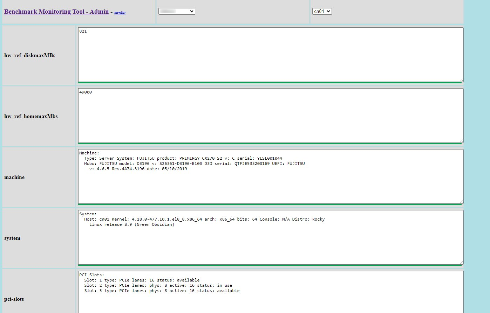

# HPC Performance Monitoring Tool
A real-time HPC performance monitoring tool with automatic node detection and basic benchmarking.
This repository contains a suite of Linux scripts designed for performance monitoring and resource benchmarking across compute nodes in an HPC environment.

## Features

### 1. Hardware Data Collection
- Detects and collects essential hardware characteristics of compute nodes.
- Gathers details such as server type, CPU, GPU, RAM, interconnect, pci, drives, partitions, raid configuration etc.

### 2. Resource Benchmarking
- Executes a series of predefined benchmarks to evaluate current available resources.
- Benchmarks include CPU and GPU performance, memory utilization, interconnect bandwidth and disk subsystem bandwidth.
- Benchmarks are run at user-defined intervals to ensure up-to-date monitoring.

### 3. Data Transmission
- The collected data is sent to a MySQL-based web server.
- The server hosts a performance monitoring GUI for comprehensive oversight of node performance and resource utilization.

## Usage

1. Clone this repository to the a user environment on the login node (not root, make sure it is accessible from all nodes).
2. Setup a separate maria-db based web server on a hosting platform.
3. On the hosting server reach to hosting_src/setup.php page via a browser and complete the setup.
4. At the login node access to the login_node_src folder as root and configure HPC1.config file according to your specific HPC environment needs as described in its README file.
5. At the login node run ./login_node_src/collect_data/data_collect.sh once (to collect HPC infrastructure data) and move all the generated txt files to hosting server's /run_as_root/ directory and then on the hosting server run the /run_as_root/set_others.php script (you can simply visit that page).
6. Enter a crontab entry at the login node (like: */5 * * * * cd ~/HPC_Monitor/root_version && /usr/bin/php ~/HPC_Monitor/root_version/sap_cron2.php for 5 minutes benchmarking intervals).
7. Access the performance monitoring GUI through the web server to view the collected data.

For a more detailed version of the installation, check out [this guide](https://www.serdaracir.net/hpc/hpc-monitoring-tool-installation/).

## Requirements

- Linux-based HPC environment: PHP7, iperf3, inxi
- Hosting environment: Apache2, PHP7, Mysql8

## Limitations

- This is the root user version of the tool. Root access to the HPC environment is required at the moment. But regular user accounts can be used on the hosting server.

## Next Work

- A work is underway to support the tool to work with Slurm for job scheduling and resource management. This will enable regular HPC users to run the tool in the future. Support for additional workload managers and environments will be added in future updates to broaden the tool's compatibility and usability across different HPC setups.
- In future versions, the tool will be enhanced to support single point of installation on a regular hosting server. This will enable a single point of installation, simplifying deployment and maintenance across multiple HPC environments for regular users.

## Project Images

  
  
  
  
  

## Contributing

Contributions are welcome! Please feel free to submit a pull request or open an issue for any bugs or feature requests.

## License

This project is licensed under the MIT License - see the [LICENSE](LICENSE) file for details.
